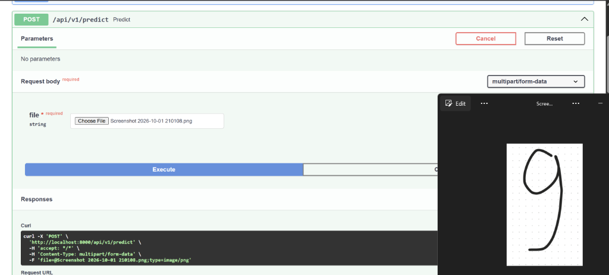
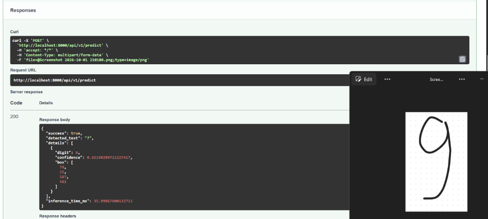

# 🔢 Handwritten Digit Recognition Microservice

> End-to-end pipeline: chụp ảnh chữ số viết tay → nhận diện chuỗi số.


## 📌 Tổng quan

Dịch vụ microservice nhận diện chuỗi chữ số viết tay (0-9) từ ảnh chụp thực tế. Pipeline xử lý hoàn chỉnh từ ảnh thô đến kết quả JSON.

### Kiến trúc hệ thống

```
Client (Postman / Web Canvas)
    │  HTTP POST /api/v1/predict
    ▼
┌──────────────────────────────────────────────┐
│            FastAPI Microservice               │
│                                               │
│  1. Input Validation (Pydantic)               │
│  2. Image Preprocessing (OpenCV)              │
│     Grayscale → Invert → Threshold → Contour  │
│     → Sort L→R → Resize 20×20 + Pad → 28×28  │
│  3. Batch Inference (ONNX Runtime)            │
│     Tensor [N,1,28,28] → Softmax → Labels    │
│  4. JSON Response                             │
└──────────────────────────────────────────────┘
```

### CNN Architecture

```
Input [1, 1, 28, 28]
  → Conv2d(1,32,3) → BatchNorm → ReLU → MaxPool(2)
  → Conv2d(32,64,3) → BatchNorm → ReLU → MaxPool(2)
  → Flatten → Linear(3136,128) → ReLU → Dropout(0.25) → Linear(128,10)
Output [1, 10]
```

## 📸 Demo Thực Tế (Swagger UI & Kết Quả)

| 1. Upload ảnh qua Swagger UI (`/docs`) | 2. Kết quả nhận diện & Phản hồi JSON |
|:---:|:---:|
|  |  |

## 🚀 Quick Start

### 1. Setup môi trường

```bash
git clone <repo-url>
cd digit-recognition-service
python -m venv venv
venv\Scripts\activate          # Windows
# source venv/bin/activate     # Linux/Mac
pip install -r requirements-dev.txt
cp .env.example .env
```

### 2. Train model

```bash
python scripts/train_cnn.py
```

Model sẽ được lưu tại `weights/mnist_cnn.onnx` (accuracy ≥ 99%).

### 3. Chạy API server

```bash
uvicorn app.main:app --reload --port 8000
```

Mở Swagger UI tại: [http://localhost:8000/docs](http://localhost:8000/docs)

### 4. Docker (optional)

```bash
docker compose up --build
```

## 📡 API Endpoints

### `GET /health`
Kiểm tra trạng thái service.

```json
{
  "status": "healthy",
  "model_loaded": true,
  "version": "1.0.0"
}
```

### `POST /api/v1/predict`
Nhận diện chữ số từ ảnh (multipart upload).

```bash
curl -X POST http://localhost:8000/api/v1/predict \
  -F "file=@test_image.png"
```

**Response:**
```json
{
  "success": true,
  "detected_text": "804",
  "details": [
    {"digit": 8, "confidence": 0.991, "box": [15, 12, 35, 55]},
    {"digit": 0, "confidence": 0.982, "box": [60, 10, 38, 57]},
    {"digit": 4, "confidence": 0.965, "box": [108, 14, 36, 52]}
  ],
  "inference_time_ms": 11.5
}
```

### `POST /api/v1/predict/base64`
Nhận diện chữ số từ ảnh base64.

```bash
curl -X POST http://localhost:8000/api/v1/predict/base64 \
  -H "Content-Type: application/json" \
  -d '{"image_base64": "<base64_string>"}'
```

## 🧪 Testing

```bash
pytest tests/ -v --tb=short
pytest tests/ -v --cov=app --cov-report=html
```

## 📁 Cấu trúc dự án

```
├── app/
│   ├── main.py                 # FastAPI app + routes
│   ├── config.py               # Cấu hình (pydantic-settings)
│   ├── schemas.py              # Pydantic models
│   ├── services/
│   │   ├── preprocessor.py     # OpenCV pipeline
│   │   └── inference.py        # ONNX Runtime engine
│   └── utils/
│       └── logger.py           # Structured logging
├── scripts/
│   ├── train_cnn.py            # Train CNN + export ONNX
│   └── evaluate_model.py       # Evaluate accuracy, F1
├── tests/                      # pytest test suite
├── weights/
│   └── mnist_cnn.onnx          # Trained model
├── Dockerfile
├── docker-compose.yml
├── requirements.txt            # Production deps
└── requirements-dev.txt        # Dev + training deps
```

## 🛠️ Tech Stack

| Component | Technology | Purpose |
|-----------|-----------|---------|
| API Framework | FastAPI | REST endpoints, auto Swagger docs |
| ML Inference | ONNX Runtime | Optimized CPU inference |
| Image Processing | OpenCV | Preprocessing pipeline |
| Training | PyTorch | CNN training (offline only) |
| Validation | Pydantic | Schema validation |
| Logging | structlog | Structured JSON logging |
| Monitoring | prometheus-client | Request metrics |
| Container | Docker | Deployment |
| CI/CD | GitHub Actions | Automated testing |

## 📄 License

MIT License
